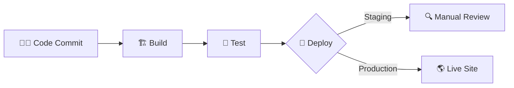

# 🚀 CI/CD Mastery: Modern DevOps Pipeline

Welcome to the **CICD** project! This repository demonstrates a robust Continuous Integration and Continuous Deployment (CI/CD) workflow for a React-based web application.

## 🌟 Introduction to CI/CD

CI/CD is a bridge between development and operation teams by enforcing automation in building, testing, and deployment of applications. It eliminates human error, increases deployment frequency, and ensures high-quality code.

### 🔄 The Three Pillars
1.  **Continuous Integration (CI):** Merging code into a shared repository several times a day. Each merge is verified by an automated build and automated tests.
2.  **Continuous Delivery:** Ensures that code is always in a deployable state, even if it's not deployed to production immediately.
3.  **Continuous Deployment (CD):** Automatically deploying every change that passes all stages of your production pipeline to your customers.

---

## 🏗️ Pipeline Architecture

Our pipeline is designed for speed and reliability. Below is a high-level visualization of the flow:



### 🛠️ Integrated Tools
- **Source Control:** GitHub
- **Build Server:** AWS CodeBuild (configured via `buildspec.yml`)
- **Deployment:** AWS S3 / CloudFront (Standard React Deployment)
- **Testing:** Jest & React Testing Library

---

## ⚡ Key Features of This Pipeline

> [!TIP]
> **Automated Testing:** Every commit triggers a full test suite to catch regressions early.
> **Environment Parity:** We use containerized build environments to ensure "it works on my machine" translates to "it works in production."
> **Artifact Management:** Successful builds create immutable artifacts, allowing for instant rollbacks if issues arise.

---

## 🏁 Getting Started

### 1. Installation
```bash
npm install
```

### 2. Running Locally
```bash
npm start
```

### 3. Running Tests
```bash
npm test
```

### 4. Direct Build
```bash
npm run build
```

---

## 📖 Deep Dive into CI/CD
For more information on why CI/CD is the backbone of modern software engineering, check out these resources:
- [AWS CI/CD Best Practices](https://aws.amazon.com/devops/continuous-integration/)
- [The Phoenix Project (Book Recommendation)](https://www.google.com/search?q=The+Phoenix+Project+book)

---
*Created with ❤️ for the DevOps Community.*
